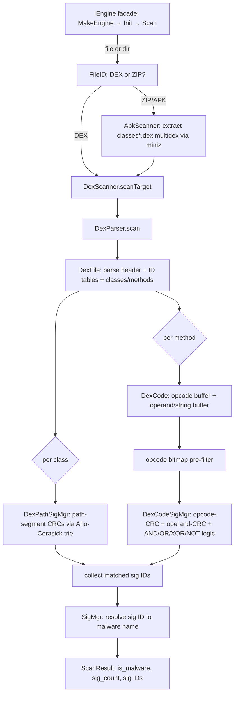

# Architecture

This document describes how `aav` detects Android malware and how the code is
organized. It also maps the implementation back to the master's thesis *"An
Efficient Android Malware Static Detection System"* that the engine is based on,
and notes where the two diverge.

## Design in one paragraph

`aav` is a **static** scanner: it never executes or emulates the target. It
parses DEX bytecode and reduces each app to a small set of **features** —
class-path fingerprints and per-method opcode/operand fingerprints — then
matches those features against a compact **signature database**. Detection is
**multi-dimensional**: a single malware family is described by several
independent features combined with boolean **logic** (AND/OR/XOR/NOT), which
keeps signatures resilient to trivial repackaging while holding false positives
down. Cheap **pre-filters** (an opcode bitmap, a path trie) run first so the
expensive checks only touch candidates that can possibly match.

## Scan pipeline

The signature database (`SigMgr`) is loaded once up front (decrypt → decompress
→ verify CRC → index sections by format) and shared by the scanners.

## Components

The engine implementation lives under `src/`; the **public API** is the handful
of headers in `include/aav/`. The exported surface is deliberately tiny: the
`aav` library marks `include/` as its only `PUBLIC` include directory and every
`src/*` dir as `PRIVATE`, so external consumers see the facade and nothing else.
First-party white-box targets (the unit tests, the fuzzer, `sigtool`, and — as a
bundled app — the Android JNI) opt into specific `src/` dirs explicitly.

**Naming:** file names are `snake_case` and types are `PascalCase` (Google C++
Style); interface *types* keep their `I` prefix (`IScanner`, `IFileMap`), and a
header that declares an interface carries an `_interface` suffix (e.g.
`aav/scanner_interface.h`, `aav/file_map_interface.h`). These live under
`src/api/aav` (private) and are included with the `aav/` prefix. The suffix keeps
each interface header's basename distinct from its concrete implementation header
— `aav/file_map_interface.h` (`IFileMap`) vs `file_map.h` (`FileMap`, under
`src/platform`) — so the two never collide on the include path. Plain data
records keep bare names (`aav/scan_result.h`, `aav/scan_option.h`, …).

### `include/aav/` — the public surface (ABI-clean facade)
Exactly what an external SDK user needs, nothing more, and deliberately
**ABI-stable**: only PODs, C strings and a callback cross it (no `std::`
containers or smart pointers), so a prebuilt `libaav.so` works across
compiler/stdlib versions.
- `engine_interface.h` — the high-level **facade**: `aav::IEngine` with
  `Init(sig_db, const EngineConfig*)`, `Scan(path, callback, user_data)` (file
  or directory) and `ScanBuffer(data, size, name, callback, user_data)` (an
  APK/DEX in RAM). Results arrive through a `ScanCallback` as a POD `ScanReport` (C strings +
  arrays, engine-owned, valid only during the call); `EngineConfig` and
  `MethodFeature` are POD too. `aav::MakeEngine()` returns a raw `IEngine*`. This
  hides file identification, signature-DB loading, scanner selection, APK
  unpacking and directory traversal behind these calls. Set
  `EngineConfig::scan_threads > 1` to parallelize directory scans (callbacks stay
  serialized).
- `object_interface.h` — `IObject`, the base whose `Destroy()` frees an object
  inside the library (ABI-safe teardown); its destructor is protected, so callers
  release with `Destroy()` and never `delete`.
- `aav.h` — umbrella header pulling in the two above.

`ObjPtr` / `ObjectReleaser` (an internal `std::unique_ptr` alias whose deleter
calls `Destroy()`) live under `src/api/aav` and are **not** exported.

### `src/engine/` — the facade implementation
`Engine` (behind `MakeEngine`) wires together `FileID`, `SigMgr`, and the APK
and DEX scanners; walks directories; extracts an APK's `classes.dex` into memory
(miniz) and scans it; and maps each internal `ScanResult` onto a POD public
`ScanReport` (resolving sig IDs to names, and — with `analysis` — attaching
per-method features) delivered through the caller's `ScanCallback`. A
multi-threaded directory scan (`EngineConfig::scan_threads > 1`) gives each
worker its own set of scanners (`FileID` + APK/DEX scanners) built from the one
shared, read-only `SigMgr`; workers pull files off an atomic index, and a mutex
serializes report emission so the callback never runs concurrently.

### `src/api/aav/` — internal object API (not exported)
The low-level pure-virtual interfaces (`IStream`, `ITarget`, `IScanner`,
`ISigMgr`, `IFileID`, …), the object factories (`factory.h`: `aav::MakeSigmgr()`,
`MakeDexScanner()`, `MakeFilestream()`, …, defined by the `src/*/lib*_export.cc`
shims), and the plain data records (`ScanResult` + `aav::ScanResultPtr`,
`ScanOption`, `LoadFormatConfig`, `SigFormat`, …). These back the facade and the
first-party white-box tools, but are not part of the exported surface.

### `src/utils/` — shared, domain-agnostic helpers
Low-level building blocks with no DEX/signature coupling, reused across layers:
`crc32` (CRC32 for the DEX feature fingerprints), `leb128` (a bounded LEB128
reader for the DEX parser), `blowfish` (the signature-DB cipher),
`file_uncompress` (gzip inflate + CRC check for the signature DB), and `log` (a
tiny runtime-leveled logger — `AAV_LOGE`/`AAV_LOGI`/`AAV_LOGD`, routed to stderr
on host and logcat on Android, quiet until `--debug` raises the level).

### `src/platform/` — OS primitives
Thin wrappers used by the rest of the engine: `FileStream`/`FileTarget`/`FileMap`
(file access + mmap), `MemStream`/`MemTarget` (a caller-owned memory block as a
stream / as a target — the memory-scan path uses `MemStream` to identify an
in-RAM APK and `MemTarget` to scan a DEX buffer), and `Module` (a dlopen RAII
wrapper for lazy-loading a shared object at runtime). `ITarget` exposes a
contiguous buffer (what the DEX parser consumes); a stream can additionally hand
back a zero-copy view of its whole content via `IStream::GetView` (the memory
buffer, or an `mmap`), which the APK scanner uses to feed miniz without copying.

### `src/scan/` — file identification & APK
`FileID` classifies a stream/target as DEX, ZIP/APK, or unknown from its magic,
so the CLI can route to the right scanner.

### `src/sig/` — the signature database
`SigMgr` loads a `*.sig` file: **Blowfish**-decrypt → **gzip**-inflate → verify
a CRC over the payload → parse a header and a sequence of typed **sections**
into `SigItem`s indexed by `SigFormat`. It also resolves a matched `sig_id`
into a human-readable name (`Type!Family.variant@Platform.FileFormat`, e.g.
`Trojan!SampleFam.a@Android.Dex`). The Blowfish cipher and gzip inflate it
relies on are generic helpers in `src/utils/` (`blowfish`, `file_uncompress`).
The on-disk layout is specified in
[`SignatureDbFormat.md`](SignatureDbFormat.md).

`ApkScanner` (also in `src/scan/`) scans an APK end to end: it takes a zero-copy
view of the archive via `IStream::GetView` (a `MemStream` returns its buffer; a
`FileStream` memory-maps the file through `IFileMap`), extracts every multidex
member (`classes.dex`, `classes2.dex`, …) with vendored **miniz** (linked
privately), and delegates detection to a DEX scan of each (sharing the caller's
`SigMgr`), merging the per-DEX hits into one result. If a stream can't provide a
view it falls back to reading the whole archive. An APK-level white-list check
is the intended future first step (it was an unimplemented stub in the original
engine); the engine facade simply calls `ScanStream` for any ZIP/APK.

### `src/dex/` — DEX parser and matchers
The heart of the engine:

- **`DexFile`** — parses the DEX header, the ID tables (strings, types, protos,
  fields, methods, class defs) and iterates classes and their direct/virtual
  methods. Accepts DEX magic versions `035`–`040` (the container and tables are
  identical across them). Hardened with explicit bounds checks and a bounded
  LEB128 reader (`leb128`), and continuously fuzzed.
- **`DexCode`** — for one method's code item, produces the two per-method
  feature streams: the **opcode buffer** (instruction opcodes) and the
  **operand/string buffer** (referenced string constants), plus their CRC32s and
  a "fast opcode" summary for the bitmap pre-filter. Its opcode-length table
  covers the method-handle / invoke-custom family (DEX 038/039), so modern
  bytecode is stepped over with correct lengths.
- **`DexParser`** — drives a scan: walks classes/methods, invokes the path and
  code matchers, and accumulates matched `sig_id`s. With `--analysis` it also
  records each method's CRC32s/strings into a `DexAnalysis` report — a single
  parse path (the opcode-bitmap pre-filter is simply bypassed so every method is
  captured), not a second implementation.
- **`DexPathSigMgr` + `ACMatcher`/`ACTree`** — dimension 1 (below). Class paths
  are split into segments, each segment hashed to a CRC32, and matched against an
  **Aho–Corasick** trie built from the path signatures.
- **`DexCodeSigMgr`** — dimensions 2–3 and the logic layer: the opcode **bitmap**
  pre-filter, the opcode-CRC and operand-CRC tables, and the AND/OR/XOR/NOT
  **logic** signatures.
- **`Dex*ScanResult*`** — accumulate and de-duplicate matches during a scan.

### Applications
- **`aavscan/`** — the CLI, a thin **facade consumer**: parse flags, `MakeEngine`
  → `Init(sig_db, config)` → `Scan(path, callback)`, print each report. It
  includes only the public `aav/engine_interface.h`.
- **`sigtool/`** — developer tooling that synthesizes a sample DEX and a matching
  signature DB whose CRCs are computed with the engine's own `crc32`, guaranteeing
  byte-for-byte parity with what the scanner computes.
- **`android/`** — a Gradle + NDK app whose JNI bridge drives the engine; being
  bundled, it is a first-party consumer with access to engine internals.

## Detection dimensions

| Dimension | Feature | Where |
| --------- | ------- | ----- |
| Class path | CRC32 of each `.`-separated path segment, matched by an Aho–Corasick trie | `DexPathSigMgr`, `ACMatcher` |
| Opcode sequence | CRC32 over a method's opcode buffer (bitmap-prefiltered) | `DexCode`, `DexCodeSigMgr` |
| Operand/string sequence | CRC32 over a method's referenced string constants | `DexCode`, `DexCodeSigMgr` |
| Logic combination | AND/OR/XOR/NOT over the above code CRCs | `DexCodeSigMgr` |

A family is typically confirmed by a **logic** signature (e.g.
`AND(opcodeCrc, operandCrc)`) rather than any single feature, which is what makes
the scheme robust to superficial changes.

## Thesis mapping & divergences

The core ideas from the thesis are implemented as above: multi-dimensional code
features, CRC-based fingerprints, the opcode bitmap accelerator, the
Aho–Corasick path matcher, and boolean logic combination.

Known divergences between the thesis and this codebase:

- **API-call-sequence dimension** — described in the thesis as a third code
  feature, but there is no dedicated API-sequence signature type in the current
  code (operand/string sequences are the closest analogue).
- **Multi-threaded engine / task queue** — directory scans are parallelized
  (`EngineConfig::scan_threads`), but via per-worker scanner sets and an atomic
  work index rather than the thesis's CAS-based task queue; the per-file scan
  core itself is sequential.
- **Non-DEX formats** — `SigFormat` reserves ELF/OAT/Mach-O/PE ids, but only DEX
  (and the `classes*.dex` inside an APK) scanning is implemented.

## Ownership & error-handling conventions

- **Ownership** is RAII: engine objects are held by `aav::ObjPtr` (external users
  create the engine with `aav::MakeEngine()`; internally the `aav::Make*`
  factories build the components); the internal `ScanResult` is held by
  `aav::ScanResultPtr`. There is no manual reference counting or `free()` at call
  sites.
- **Errors** currently use the historical `int` status convention (`0` = success,
  negative = failure; the DEX iterators additionally use `-2` for "skip"). A
  migration to an `expected`-style result type is a possible future change but is
  intentionally out of scope for the "same behavior" modernization pass.
